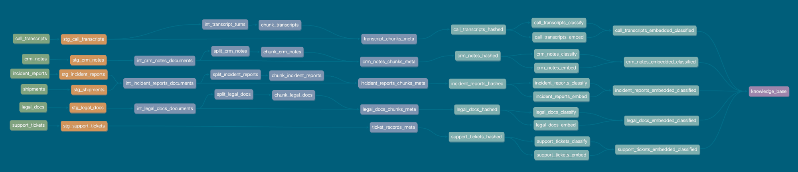

# jaffle logistics

A fictional logistics company's data, scattered across roughly eight
disconnected systems (CRM, support tickets, dispatch notes, incident
reports, legal contracts, Slack, call transcripts), used as a worked
example of where exact-match SQL (joins, regex) runs out of road, and
what it takes to get past that ceiling while staying in dbt: chunking,
embedding, and classifying free text into a governed, searchable
knowledge base via
[`dbt_context_engineering`](https://github.com/dbt-labs/dbt-context-engineering).
The full story, with real query output, lives in [`docs/`](docs/index.md).

## Lineage

The context-engineering pipeline, colored by phase (source, staging,
up-to-meta, up-to-knowledge-base, knowledge base):



## Project structure

```
.
├── models/
│   ├── staging/
│   ├── intermediate/
│   ├── marts/
│   └── context/
│       └── ai/
├── seeds/
├── analyses/
├── macros/
├── tests/
└── docs/
```

| Path | Contents |
|---|---|
| `models/staging/` | One model per source system, cleans and casts raw seed data |
| `models/intermediate/` | Cross-source joins (shipment touchpoints, SLA rollups) |
| `models/marts/` | Client/driver/hub dimensions and fact tables |
| `models/context/` | The context-engineering pipeline: chunk/reshape and hash, one independent chain per source (legal docs, incident reports, CRM notes, call transcripts, support tickets) |
| `models/context/ai/` | `embed()`/`classify()` calls per source, plus `knowledge_base` (unions all five) and `search` — gated behind `ai_layer_enabled`, real billed cloud calls |
| `seeds/` | Source data as CSVs, one per system above, plus two unused eval seeds for a classify-and-eval layer that isn't built yet |
| `analyses/` | The deterministic (join-only) and narrative demo queries |
| `macros/` | Portable cross-warehouse helpers and AI prompt definitions |
| `tests/` | Singular tests, including an AI-run-log completeness check |
| `docs/` | The full write-up, built as an mkdocs-material site |

Four adapters are supported: DuckDB (local, free), Snowflake, BigQuery, and
Databricks. Only DuckDB has no `embed()`/`classify()` implementation, so it's
the only target where the AI layer can never bill.

## Docs site

This project has models to illustrate a specific story. The full story, including
real search results, is in `docs/` and builds as an
mkdocs-material site (`mkdocs serve` / `mkdocs build`, `mkdocs.yml` at repo
root):

- [The problem](docs/the-problem.md) — the join-and-regex baseline, and where it breaks
- [Context engineering](docs/context-engineering.md) — chunk, embed, enrich, combine, search
- [Comparison](docs/comparison.md) — join-based vs. semantic retrieval, against real output
- [Governance](docs/governance.md) — cost guards, audit log, incremental reruns
- [Multi-platform](docs/multi-platform.md) — cross-engine SQL portability fixes
- [Roadmap](docs/roadmap.md) — what's deliberately not built yet
