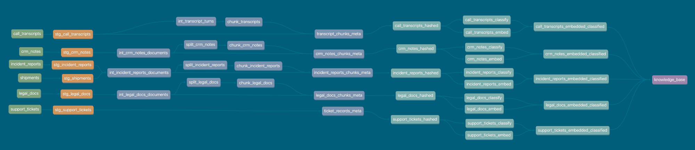

# jaffle logistics

A fictional logistics company's data, scattered across roughly eight
disconnected systems (CRM, support tickets, dispatch notes, incident
reports, legal contracts, Slack, call transcripts), used as a worked
example of where exact-match SQL (joins, regex) runs out of road, and
what it takes to get past that ceiling while staying in dbt: chunking,
embedding, and classifying free text into a governed, searchable
knowledge base via
[`dbt_context_engineering`](https://github.com/dbt-labs/dbt-context-engineering).
The full story, with real query output, lives in [`docs/`](docs/index.md).

## How to use this project

### Prerequisites

- dbt Core 1.12 or higher (required for `vars.yml` support)
- An adapter for whichever warehouse you want to target: `dbt-duckdb`, `dbt-snowflake`, `dbt-bigquery`, or `dbt-databricks`


### Get running locally with DuckDB

DuckDB is the fastest path to seeing the project run, and the only target where the AI layer can never bill, since DuckDB has no `embed()` or `classify()` implementation.

1. Install dependencies.

   ```bash
   dbt deps
   ```

2. Add a profile named `jaffle-logistics` to `~/.dbt/profiles.yml`.

   ```yaml
   jaffle-logistics:
     target: duckdb
     outputs:
       duckdb:
         type: duckdb
         path: jaffle_logistics.duckdb
         threads: 4
   ```

3. Build the project.

   ```bash
   dbt build
   ```

   This seeds the source CSVs and builds the staging, intermediate, and marts models. The AI layer under `models/context/ai/` is skipped. `dbt_project.yml` sets `ai_functions_enabled: false` by default, so a plain `dbt build` never triggers a billed `embed()` or `classify()` call.

### Run on Databricks

1. Install the adapter alongside dbt Core 1.12.

   ```bash
   pip install "dbt-core>=1.12,<1.13" dbt-databricks
   dbt deps
   ```

2. Add a `databricks` output to the `jaffle-logistics` profile and select it with `--target databricks` (or make it the profile's default `target`).

   ```yaml
   jaffle-logistics:
     target: duckdb
     outputs:
       # duckdb: ... (as above)
       databricks:
         type: databricks
         host: "{{ env_var('DATABRICKS_HOST') }}"            # e.g. dbc-1234abcd-5678.cloud.databricks.com
         http_path: "{{ env_var('DATABRICKS_HTTP_PATH') }}"  # SQL warehouse > Connection details
         token: "{{ env_var('DATABRICKS_TOKEN') }}"
         catalog: "{{ env_var('DATABRICKS_CATALOG', 'main') }}"  # a Unity Catalog catalog you can create schemas in
         schema: jaffle_logistics
         threads: 8
   ```

3. Build the deterministic layer. Any SQL warehouse or cluster works for this step, and no AI functions are called.

   ```bash
   dbt build --target databricks
   ```

4. Optionally, build the AI layer (real, billed `ai_query()` and `ai_classify()` calls):

   ```bash
   dbt build --target databricks --vars '{"ai_functions_enabled": true}'
   ```

   This step has stricter prerequisites than step 3:

   - **A serverless SQL warehouse (DBR 18.2+).** `ai_classify()` and `vector_cosine_similarity()` aren't available on classic or Pro warehouses. `dbt_context_engineering`'s serverless check is currently a no-op stub, so on the wrong warehouse type the AI models fail at run time with a Databricks "function not found" error, not a clear dbt message.
   - **Access to the Foundation Model serving endpoints** named in `vars.yml`: `databricks-gte-large-en` (`embedding_model`) and `databricks-claude-haiku-4-5` (`model_generate`). Availability varies by region. If yours differs, override per invocation, e.g. `--vars '{"ai_functions_enabled": true, "embedding_model": "<your-endpoint>"}'`. Changing the embedding model changes the embedding fingerprint. The next build then re-embeds the whole corpus (billed), and the `embedding_canary` drift check has no baseline to compare against until you re-bless one (`dbt run-operation print_embedding_canary`).

### Running the AI layer

Setting `ai_functions_enabled: true` builds the models under `models/context/ai/` instead of skipping them. Point your profile at Snowflake, BigQuery, or Databricks for that to mean real work: `embed()` and `classify()` calls that hit a real model endpoint and bill.

```bash
dbt build --vars '{"ai_functions_enabled": true}'
```

The same flag also builds these models on DuckDB, but each one detects the DuckDB target and substitutes a hardcoded placeholder, either a zero vector or a fixed label, instead of calling `embed()`/`classify()`. The build succeeds and produces real rows, just with fake, structurally-compatible values instead of real AI output. So "DuckDB is the only target where the AI layer can never bill" describes this substitution, rather than a build failure or a skipped model.

See [governance](docs/governance.md) for what the cost guards and audit log around this call do.

## Lineage

The context-engineering pipeline, colored by phase (source, staging,
up-to-meta, up-to-knowledge-base, knowledge base):



## Project structure

```
.
├── models/
│   ├── staging/
│   ├── intermediate/
│   ├── marts/
│   └── context/
│       └── ai/
├── seeds/
├── analyses/
│   └── the_pattern/
├── macros/
├── tests/
└── docs/
```

| Path | Contents |
|---|---|
| `models/staging/` | One model per source system, cleans and casts raw seed data |
| `models/intermediate/` | Cross-source joins (shipment touchpoints, SLA rollups) |
| `models/marts/` | Client/driver/hub dimensions and fact tables |
| `models/context/` | The context-engineering pipeline: chunk/reshape and hash, one independent chain per source (legal docs, incident reports, CRM notes, call transcripts, support tickets) |
| `models/context/ai/` | `embed()`/`classify()` calls per source, plus `knowledge_base` (unions all five) and `search` — gated behind `ai_functions_enabled`, real billed cloud calls |
| `seeds/` | Source data as CSVs, one per system above, plus two unused eval seeds for a classify-and-eval layer that isn't built yet |
| `analyses/` | The deterministic (join-only) and narrative demo queries |
| `analyses/the_pattern/` | The chunk/embed/combine/search pipeline broken into seven numbered, runnable steps, one query per stage |
| `macros/` | Portable cross-warehouse helpers and AI prompt definitions |
| `tests/` | Singular tests, including an AI-run-log completeness check |
| `docs/` | The full write-up, built as an mkdocs-material site |

Four adapters are supported: DuckDB (local, free), Snowflake, BigQuery, and
Databricks. Only DuckDB has no `embed()`/`classify()` implementation, so it's
the only target where the AI layer can never bill.

## Docs site

This project has models to illustrate a specific story. The full story, including
real search results, is in `docs/` and builds as an
mkdocs-material site (`mkdocs serve` / `mkdocs build`, `mkdocs.yml` at repo
root):

- [The problem](docs/the-problem.md) — the join-and-regex baseline, and where it breaks
- [Context engineering](docs/context-engineering.md) — chunk, embed, enrich, combine, search
- [Comparison](docs/comparison.md) — join-based vs. semantic retrieval, against real output
- [Governance](docs/governance.md) — cost guards, audit log, incremental reruns
- [Multi-platform](docs/multi-platform.md) — cross-engine SQL portability fixes
- [Roadmap](docs/roadmap.md) — what's deliberately not built yet

## Known issues

External issues that block or limit part of this project. Tracked upstream; not fixable here.

- **[dbt-core#16128](https://github.com/dbt-labs/dbt-core/issues/16128)**: on the Fusion engine (`dbt-fusion`), the DuckDB adapter fails to load a seed owned by an installed package. Symptom is an `IO Error: No files found` against a doubled path (`.../dbt_packages/<pkg>/dbt_packages/<pkg>/seeds/<file>.csv`). Confirmed Fusion-engine-only: `dbt-core` 1.12 loads the same seed fine on every adapter, and Fusion loads it fine on Snowflake, BigQuery, and Databricks; only the DuckDB adapter under Fusion fails. In this project it only affects `dbt_context_engineering`'s `embedding_canary_baseline` seed, which only builds when `ai_functions_enabled: true`. A plain `dbt build`/`dbtf build` is unaffected, since that seed stays disabled by default. Resolves automatically once dbt-fusion ships a fix; no project-side action needed.

## Support & maintenance

This project is provided as-is, without SLAs. It's a worked example, not a maintained product, and maintenance is best-effort.

To report an issue or request a change, open a GitHub issue or discussion on this repo.