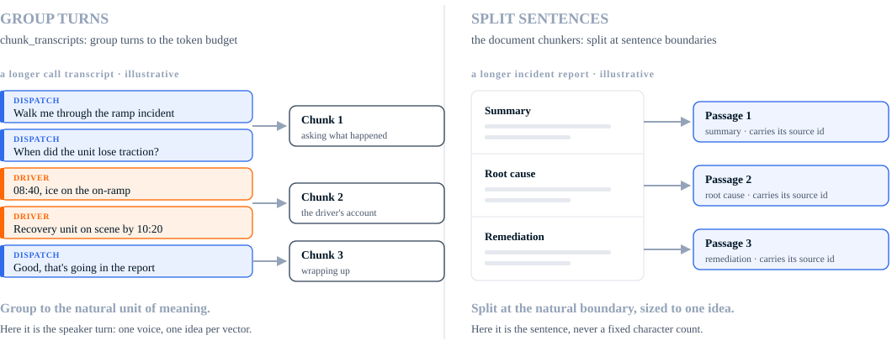
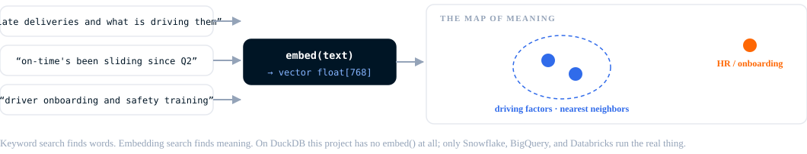
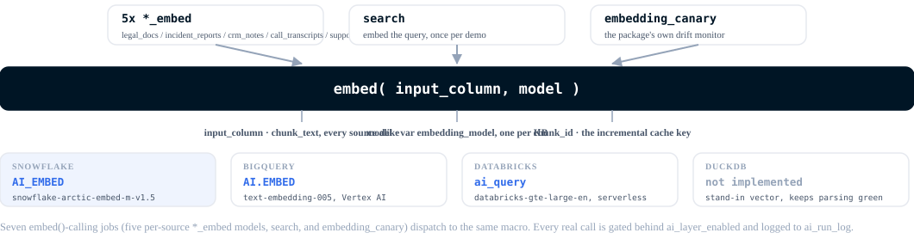

# Context engineering: chunk, embed, enrich, search

[`dbt_context_engineering`](https://github.com/dbt-labs/dbt-context-engineering)
turns the free text [the problem](the-problem.md) couldn't reach into a
governed, searchable knowledge base, entirely in SQL, orchestrated by
dbt. The fix for exact-match SQL's ceiling isn't leaving SQL. It's SQL
that can call an embedding function.

The pipeline has five stages: chunk, embed, enrich, combine, search.
Embed and enrich are siblings, not a sequence: both run on the same
chunk corpus, independently, and their outputs get joined before
`knowledge_base` combines everything into one relation. This project's
own search results are the evidence enrichment earns its place next to
embedding, not after it (see [comparison](comparison.md)).

This is a real, governed, multi-platform building block, not the whole
of a RAG pattern. [Roadmap](roadmap.md) covers what it still needs.

## Chunk: on the data's logical boundaries

Two source shapes, two chunking strategies.

Call transcripts explode into individual spoken turns
(`int_transcript_turns`), then regroup into token-bounded chunks that
never span a transcript (`chunk_transcripts`). Documents (legal docs,
incident reports, CRM notes) split into sentences first
(`split_context_docs`), then regroup the same way into chunks that
never span a document (`chunk_docs`).

Both paths land in [`chunks_with_meta`](https://github.com/dbt-labs/jaffle-logistics/blob/main/models/context/chunks_with_meta.sql):
one chunk corpus, with `client_id`, `source_type`, and a citation URL
on every row.

A real example, the Jaffle Equipment QBR transcript from
[comparison](comparison.md), split across an actual chunk boundary:

| chunk_id | client_id | source_type | chunk_text (excerpt) |
|---|---|---|---|
| `CT-99001::1` | `CLI-0042` | call_transcript | Marcus Trent: Janet, thanks for taking this. I know the last two weeks have been rough, I want to own it.\nJanet Feld: Rough is generous, Marcus. The Chicago storm buried a whole batch of our freight.\nMarcus Trent: I know, and it's documented on our side... |
| `CT-99001::2` | `CLI-0042` | call_transcript | Janet Feld: It did. My question is whether you can actually handle our peak volume, because right now I'm not sure.\nMarcus Trent: Fair. Two things: we're issuing an SLA credit for January per your contract... |

The boundary lands on a turn. `chunk_transcripts` and `chunk_docs` bin
whole units (a turn, a sentence) by running token count and never split
a unit mid-way. This project's `chunk_overlap_tokens` is 0, so adjacent
chunks share no context across a cut. Overlap is a real technique for
recovering that lost context; skipping it here isn't a recommendation to
skip it generally, it's just this project's setting.

The same binning rule can produce a very short trailing chunk. `IR-9001`
splits into three real chunks, and the third is a single sentence,
"Reviewed with dispatch." [Comparison](comparison.md) covers what that
does to search.

Chunking costs nothing beyond ordinary SQL compute. No `embed()`,
`generate()`, or `classify()` call happens here.

## Embed: for recall

[`chunk_embeddings`](https://github.com/dbt-labs/jaffle-logistics/blob/main/models/context/ai/chunk_embeddings.sql)
embeds the chunk corpus. It's incremental: the package's six-column
cache metadata (ADR-0023) means unchanged chunks are never re-embedded.

[`ticket_embeddings`](https://github.com/dbt-labs/jaffle-logistics/blob/main/models/context/ai/ticket_embeddings.sql)
embeds tickets whole. Tickets are short enough that chunking would add
nothing.

One embedding model, set by `embedding_model`, covers the whole
knowledge base, so every vector lives in the same comparable space.

Embedding gets you recall: retrieval by meaning instead of exact string.
It doesn't get you precision. In this project's own search results, a
six-token trailing sentence and a contract's signature block outrank
real account signal on plain cosine similarity (see
[comparison](comparison.md)). That's what enrichment fixes.

## Enrich: for precision

[`chunk_classifications`](https://github.com/dbt-labs/jaffle-logistics/blob/main/models/context/ai/chunk_classifications.sql)
and [`ticket_classifications`](https://github.com/dbt-labs/jaffle-logistics/blob/main/models/context/ai/ticket_classifications.sql)
run a real `classify()` call against the same chunk and ticket corpus
embedding uses, independently, one flat taxonomy:
`account_assessment`, `contract_reference`, `weather_disruption`,
`vehicle_or_driver_incident`, `handling_or_warehouse_error`,
`routine_status`. Each label is a business category, not a judgment of
how well the text is written, and it matches the weather-vs-handling
split the account's own root-cause review makes (see
[comparison](comparison.md)).

[`chunk_embeddings_classified`](https://github.com/dbt-labs/jaffle-logistics/blob/main/models/context/ai/chunk_embeddings_classified.sql)
and its ticket counterpart join the label onto the embedded rows, so
`knowledge_base` carries both and `search.sql` can filter on the label
directly.

Same governed pattern as the embedding models: `guard_batch` and
`log_ai_run` as pre-hooks, `complete_ai_run` as a post-hook, gated
behind `ai_layer_enabled`. Not incremental, though: `classify()` has no
cache metadata the way `embed()` does, so every build reclassifies the
whole corpus. At this demo's scale (120 chunks, 189 tickets) that's a
small, disclosed cost; a larger corpus would need the equivalent of
`embed()`'s caching before copying this pattern as-is.

## Combine: one shape, two sources

[`knowledge_base`](https://github.com/dbt-labs/jaffle-logistics/blob/main/models/context/ai/knowledge_base.sql)
unions `chunk_embeddings_classified` and `ticket_embeddings_classified`
into one shape: `source_type`, `source_id`, `account_key`, `text`,
`embedding`, `ts`, `citation_url`, `classification`. The citation URL
preserves the finer-grained artifact type (which CRM note, which
incident report), so any result traces back to its source.
`classification` is an optional slot in the package's shape; this
project fills it for every source.

## Search: by meaning, then by category

[`search.sql`](https://github.com/dbt-labs/jaffle-logistics/blob/main/models/context/ai/search.sql)
embeds a query once, then runs cosine similarity against
`knowledge_base`. Two demos, each run twice, raw and filtered on
`classification`:

- **Account-scoped**: "late deliveries and what is driving them,"
  filtered to `account_key = 'CLI-0042'`; the classified run adds
  `classification = 'account_assessment'`.
- **Whole-corpus**: "truck accident during the Chicago winter storm," no
  account filter, the kind of question a join can't answer since
  there's no ID to join on; the classified run adds
  `classification = 'weather_disruption'`.

All four ran for real, against real embeddings and a real `classify()`
pass. The raw runs don't return a clean top 10. The classified runs
mostly do, with one disclosed gap. [Comparison](comparison.md) has the
actual ranked output for all four.

Cosine similarity at this scale doesn't need to be indexed.
`dbt run-operation create_vector_index` adds one (Snowflake Cortex
Search, a BigQuery vector index, or a separately-billed Databricks
Vector Search index) for when that stops being true, torn down
explicitly rather than left running.

## Six AI jobs, three cost tiers

Everything upstream of embed/enrich costs ordinary compute, the same
warehouse credits any dbt model burns. From there on, every model makes
a real, billed AI-function call. Three cost tiers apply project-wide:

- **Zero cost**: local DuckDB runs. DuckDB has no `embed()` or
  `classify()` implementation, so nothing bills.
- **Cloud compute cost**: the deterministic chunking layer on Snowflake,
  BigQuery, or Databricks. Ordinary warehouse credits, no AI billing.
- **Cloud AI-function cost**: `models/context/ai/*` on a cloud
  warehouse. Real, billed `embed()` or `classify()` calls.

The diagram covers the four `embed()`-calling jobs (`chunk_embeddings`,
`ticket_embeddings`, `search`, and the package's own `embedding_canary`
monitor). `chunk_classifications` and `ticket_classifications` make the
same billed-call shape with `classify()` instead, dispatched to
`AI_CLASSIFY` on Snowflake, `ai_classify` on Databricks, and a
schema-constrained `AI.GENERATE` on BigQuery: six AI-calling jobs total,
one gate.

That gate is `ai_layer_enabled` in `dbt_project.yml`, `false` by
default. It's a real dbt `+enabled` config, so a disabled model can't
build even under an explicit `--select`. A plain `dbt build` never
triggers AI spend. Turning it on is one flag:
`--vars '{ai_layer_enabled: true}'`, covering `embedding_canary` too, so
enabling spend is one decision, not several.

See [governance](governance.md) for the cost guards, audit log, and
incremental design behind that gate.
